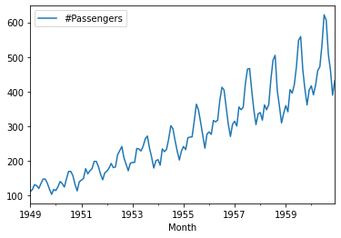
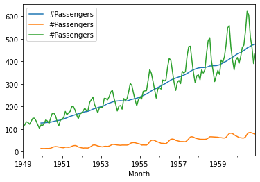
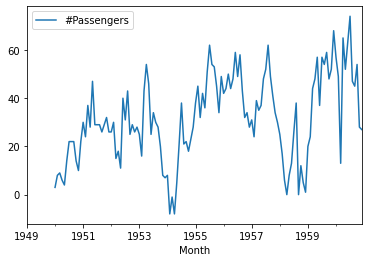
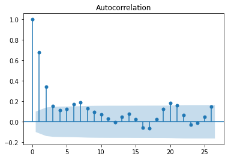
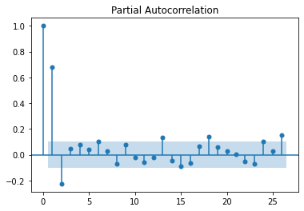
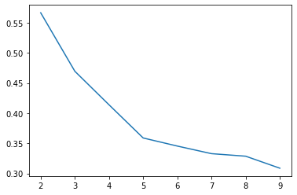
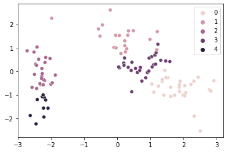

# Phase 4 Code Challenge Review


```python
from src.student_caller import one_random_student
from src.student_list import quanggang 

%load_ext autoreload
%autoreload 2
```

TOC:

  - [Time Series](#ts)  

  - [Clustering](#clust)
    

<a id='ts'></a>

# Time Series


```python
import pandas as pd
import numpy as np
```


```python
ap = pd.read_csv('data/AirPassengers.csv')
```

With the data above, what is the first step in transforming it into data suitable for our time series models?

> Your answer here


```python
# Perform that step in code
```


```python
#__SOLUTION__
ap.set_index(pd.to_datetime(ap['Month'], format = '%Y-%m'), inplace=True)
ap.drop('Month', axis = 1, inplace=True)
```

What types of trends might we expect to find in our time series datasets?


```python
# plot the time series
```


```python
#__SOLUTION__
ap.plot()
```


    <AxesSubplot:xlabel='Month'>





What type of trends do you see in the above plot?

> Your answer here


```python
# Add to the plot to visualize trends by looking at summary statistics across a window of time.
```


```python
#__SOLUTION__
import matplotlib.pyplot as plt
fig, ax = plt.subplots()
ap.rolling(12).mean().plot(ax=ax)
ap.rolling(12).std().plot(ax=ax)
ap.plot(ax=ax)
```


    <AxesSubplot:xlabel='Month'>





What are some ways to remove those trends? 


```python
#__SOLUTION__
fig, ax = plt.subplots()
ap.diff(12).plot(ax=ax)


```


    <AxesSubplot:xlabel='Month'>





What is the goal of removing those trends?

> Your answer here

How can we diagnose whether we have successfully removed the trends?

> Your answer here

Use the Augmented Dickey Fuller test to see if the detrended data is ready for modeling


```python
# your code here
```


```python
#__SOLUTION__
from statsmodels.tsa.stattools import adfuller

adfuller(ap.diff(12).dropna())
```


    (-3.383020726492481,
     0.011551493085514952,
     1,
     130,
     {'1%': -3.4816817173418295,
      '5%': -2.8840418343195267,
      '10%': -2.578770059171598},
     919.527129208137)


How can ACF/PACF plots below help us pick our model coefficients?


```python
from statsmodels.graphics.tsaplots import plot_pacf
plot_pacf(ap.diff(12).dropna())
```


```python
from statsmodels.graphics.tsaplots import plot_acf

plot_acf(ap.diff(12).dropna())

```


Let's look at another dataset with a smaller time unit.


```python
aq = pd.read_csv('data/AirQualityUCI.csv', delimiter=';')
aq.head()
```


<div>
<style scoped>
    .dataframe tbody tr th:only-of-type {
        vertical-align: middle;
    }

    .dataframe tbody tr th {
        vertical-align: top;
    }

    .dataframe thead th {
        text-align: right;
    }
</style>
<table border="1" class="dataframe">
  <thead>
    <tr style="text-align: right;">
      <th></th>
      <th>Date</th>
      <th>Time</th>
      <th>CO(GT)</th>
      <th>PT08.S1(CO)</th>
      <th>NMHC(GT)</th>
      <th>C6H6(GT)</th>
      <th>PT08.S2(NMHC)</th>
      <th>NOx(GT)</th>
      <th>PT08.S3(NOx)</th>
      <th>NO2(GT)</th>
      <th>PT08.S4(NO2)</th>
      <th>PT08.S5(O3)</th>
      <th>T</th>
      <th>RH</th>
      <th>AH</th>
      <th>Unnamed: 15</th>
      <th>Unnamed: 16</th>
    </tr>
  </thead>
  <tbody>
    <tr>
      <th>0</th>
      <td>10/03/2004</td>
      <td>18.00.00</td>
      <td>2,6</td>
      <td>1360.0</td>
      <td>150.0</td>
      <td>11,9</td>
      <td>1046.0</td>
      <td>166.0</td>
      <td>1056.0</td>
      <td>113.0</td>
      <td>1692.0</td>
      <td>1268.0</td>
      <td>13,6</td>
      <td>48,9</td>
      <td>0,7578</td>
      <td>NaN</td>
      <td>NaN</td>
    </tr>
    <tr>
      <th>1</th>
      <td>10/03/2004</td>
      <td>19.00.00</td>
      <td>2</td>
      <td>1292.0</td>
      <td>112.0</td>
      <td>9,4</td>
      <td>955.0</td>
      <td>103.0</td>
      <td>1174.0</td>
      <td>92.0</td>
      <td>1559.0</td>
      <td>972.0</td>
      <td>13,3</td>
      <td>47,7</td>
      <td>0,7255</td>
      <td>NaN</td>
      <td>NaN</td>
    </tr>
    <tr>
      <th>2</th>
      <td>10/03/2004</td>
      <td>20.00.00</td>
      <td>2,2</td>
      <td>1402.0</td>
      <td>88.0</td>
      <td>9,0</td>
      <td>939.0</td>
      <td>131.0</td>
      <td>1140.0</td>
      <td>114.0</td>
      <td>1555.0</td>
      <td>1074.0</td>
      <td>11,9</td>
      <td>54,0</td>
      <td>0,7502</td>
      <td>NaN</td>
      <td>NaN</td>
    </tr>
    <tr>
      <th>3</th>
      <td>10/03/2004</td>
      <td>21.00.00</td>
      <td>2,2</td>
      <td>1376.0</td>
      <td>80.0</td>
      <td>9,2</td>
      <td>948.0</td>
      <td>172.0</td>
      <td>1092.0</td>
      <td>122.0</td>
      <td>1584.0</td>
      <td>1203.0</td>
      <td>11,0</td>
      <td>60,0</td>
      <td>0,7867</td>
      <td>NaN</td>
      <td>NaN</td>
    </tr>
    <tr>
      <th>4</th>
      <td>10/03/2004</td>
      <td>22.00.00</td>
      <td>1,6</td>
      <td>1272.0</td>
      <td>51.0</td>
      <td>6,5</td>
      <td>836.0</td>
      <td>131.0</td>
      <td>1205.0</td>
      <td>116.0</td>
      <td>1490.0</td>
      <td>1110.0</td>
      <td>11,2</td>
      <td>59,6</td>
      <td>0,7888</td>
      <td>NaN</td>
      <td>NaN</td>
    </tr>
  </tbody>
</table>
</div>


```python
# Explain what this gnarly bit of code doing? 
aq['date_time'] = pd.to_datetime(aq['Date'] + ' ' + aq['Time'], format='%d/%m/%Y %H.%M.%S')
aq.set_index('date_time', inplace=True)
```

Which of the features are possible candidates for time series modeling?

> Your answer here


```python
aq['PT08.S1(CO)'].plot()
```


    <AxesSubplot:xlabel='date_time'>


What's going on here? Reference the [docs](https://archive.ics.uci.edu/ml/datasets/Air+Quality)


```python

aq_replaced = np.where(aq['PT08.S1(CO)'] ==-200, np.nan, aq['PT08.S1(CO)'])
aq_replaced = pd.Series(aq_replaced, index=aq.index)
```

What techniques do we have to fill the nan's in our data?

Use one of the techniques mentioned above to fill the data.


```python
# Your code here
```

Let's look at the daily levels of PT08.S1(CO)


```python
# Your code here
```


```python
# resample to the day
aq_replaced.resample('D').mean().plot()
```


    <AxesSubplot:xlabel='date_time'>


Plot the pacf and acf's for the resampled data.  Use it to identify the AR/MA components.


```python
# Your code here
```


```python
#__SOLUTION__
plot_acf(aq_replaced.resample('D').mean().dropna())
```





```python
#__SOLUTION__
plot_pacf(aq_replaced.resample('D').mean().dropna())
```





<a id='pca'></a>

<a id='clust'></a>

# Clustering

Question: What is the difference between supervised and unsupervised learning?

> Your answer here

Describe how the KMeans algorithm works.

Be sure to mention initialization and how it updates.


> Your answer here

How does KMeans know how many clusters to make?

> Your answer here

How does KMeans assess the best clusters?  Look at the doc-string if you need to.

> Your answer here


```python
from sklearn.cluster import KMeans

KMeans()
```


    KMeans()


## Agglomerative Clustering


```python
from sklearn.cluster import AgglomerativeClustering

ag = AgglomerativeClustering()

```

Describe how Heirarchical Agglomerative Clustering works.

Be sure to mention how it inititializes, and how clusters are formed.

> Your answer here

What are linkages? Explain how the default linakage works in the model. 

> Your answer here

How does heirarchical aglomerative clustering decide how many clusters to make?

What metrics do we have to score the clusters which are formed?

> Your answer here

Describe the difference between them.

> Your answer here

Let's code together. For the iris dataset loaded below, implement a heirarchical agglomerative clusterer with the appropriate fitting technique with a simple train-test-split.

Choose the appropriate ammount of clusters based on an appropriate metric. 

Bonus: Use PCA to visualize in two dimensions the cluster groups of the best metric.


```python
from sklearn.datasets import load_iris

data = load_iris()
X = pd.DataFrame(data['data'])
y = data['target']
```


```python
#__SOLUTION__
from sklearn.model_selection import train_test_split
from sklearn.preprocessing import StandardScaler
from sklearn.metrics import silhouette_score

X_train, X_test, y_train, y_test = train_test_split(X,y, random_state=42)
```


```python
#__SOLUTION__
ss = StandardScaler()
X_tr_sc = ss.fit_transform(X_train)

silhouette = []
for _ in range(2,10):
    
    agg = AgglomerativeClustering(_)
    agg.fit(X_tr_sc)
    silhouette.append(silhouette_score(X_tr_sc, agg.labels_))
    
```


```python
#__SOLUTION__
fig, ax = plt.subplots()
ax.plot(range(2,10), silhouette)
```


    [<matplotlib.lines.Line2D at 0x16dd2c100>]





```python
#__SOLUTION__
from sklearn.decomposition import PCA
import seaborn as sns
agg = AgglomerativeClustering(5)
agg.fit(X_tr_sc)

pca = PCA(n_components=2)
X_tr_pca_2 = pca.fit_transform(X_tr_sc)

fig, ax = plt.subplots()

sns.scatterplot(X_tr_pca_2[:,0], X_tr_pca_2[:,1], hue=agg.labels_);
```

    /Users/johnmaxbarry/anaconda3/envs/learn-env/lib/python3.8/site-packages/seaborn/_decorators.py:36: FutureWarning: Pass the following variables as keyword args: x, y. From version 0.12, the only valid positional argument will be `data`, and passing other arguments without an explicit keyword will result in an error or misinterpretation.
      warnings.warn(





```python

```
